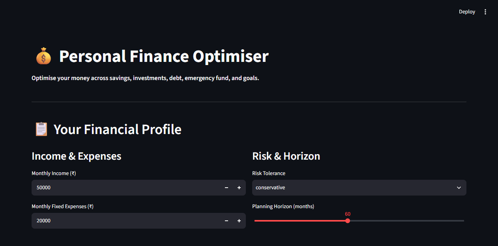

# 💰 Personal Finance Optimiser

> **Recurz Hackathon — Fintech PS2**  
> Optimise your money across savings, investments, debt repayment, emergency fund, and financial goals.

---

## 🎯 Problem Statement

Personal financial planning requires balancing savings, investments, debt repayment, emergency reserves, and long-term financial goals. Optimising one decision can affect another, making it difficult to determine the best overall financial strategy.

## 💡 Our Solution

A **dynamic financial optimisation engine** that:

- Takes your complete financial profile as input
- Generates an **optimal monthly allocation** across 5 categories
- **Adapts in real-time** when life changes (income drop, new debt, new goal)
- Projects your **net worth, debt payoff, and goal progress** over time
- Provides **personalised recommendations** based on your situation

### Key Features

| Feature | Description |
|---------|-------------|
| 🧮 Smart Allocation | Prioritises emergency fund → high-interest debt → goals → investments |
| 📊 Interactive Dashboard | Pie charts, line projections, progress bars |
| 🔄 Dynamic Reassessment | Inject life events and see your plan adapt instantly |
| 💡 Recommendations | Actionable insights based on your financial profile |
| 📈 Net Worth Projection | See your financial trajectory over 1-10 years |

---

## 🛠️ Tech Stack

- **Python** — Core language
- **Streamlit** — Web dashboard (single-file app)
- **SciPy** — Optimisation engine
- **Plotly** — Interactive charts
- **NumPy** — Numerical computation

---

## 🚀 How to Run

### Prerequisites
- Python 3.9+
- pip

### Installation

```bash
# Clone the repository
git clone https://github.com/YOUR_USERNAME/finance-optimiser.git
cd finance-optimiser

# Install dependencies
pip install -r requirements.txt

# Run the app
streamlit run app.py
```

The app will open at `http://localhost:8501`

---

## 🌐 Live Demo

**https://finance-optimiser.streamlit.app/**

## 📸 Screenshots

### Dashboard Input


---

## 🧠 Algorithm

### Allocation Priority (Waterfall Method)

1. **Emergency Fund** — If below target (3-6 months expenses), allocate 30% of disposable income
2. **Minimum Debt Payments** — Cover all minimum payments
3. **High-Interest Debt** — Extra 20% toward debts > 10% interest (avalanche method)
4. **Financial Goals** — Nearest deadline first, proportional allocation
5. **Remaining Split** — Based on risk tolerance:
   - Conservative: 60% savings, 40% investments
   - Moderate: 30% savings, 70% investments
   - Aggressive: 10% savings, 90% investments

### Dynamic Re-planning

When a life event occurs (income change, new expense, rate change, new goal), the system re-runs the allocation engine from the current state with updated parameters.

---

## 📁 Project Structure

```
finance-optimiser/
├── app.py              # Main Streamlit application
├── requirements.txt    # Python dependencies
├── README.md           # This file
├── .gitignore          # Git ignore rules
└── screenshots/        # Dashboard screenshots
```

---

## 👥 Team Details

- **Team Name:** SHER
- **Domain:** Fintech
- **Problem Statement:** Personal Finance Optimiser (PS2)

---

## 📄 License

This project was built for Recurz Hackathon, Manipal University Jaipur.

---

**Built with ❤️ at Recurz 2026**
